### ✨ The Magic Behind AI Clipping

```mermaid
flowchart LR
    %% Detailed AI Engine
    subgraph AI_Engine ["🧠 AI Magic"]
        direction TB
        analyze["Smart Content Analysis<br/>• Emotion Detection<br/>• Engagement Scoring<br/>• Trend Analysis"]
        detect["Advanced Scene Detection<br/>• Viral Moment Finder<br/>• Drama Peaks<br/>• Action Sequences"]
        optimize["Smart Optimization<br/>• Length Perfect<br/>• Platform Ready<br/>• Audience Targeted"]

        analyze --> detect
        detect --> optimize
    end

    %% Rich Enhancement Features
    subgraph Enhancement ["✨ Pro Enhancement"]
        direction TB
        subtitle["Intelligent Subtitles<br/>• 30+ Languages<br/>• Auto Translation<br/>• Perfect Timing"]
        music["Premium Audio<br/>• Trending Music<br/>• Sound Effects<br/>• Voice Enhancement"]
        effects["Visual Magic<br/>• Color Grading<br/>• Transitions<br/>• Brand Elements"]

        subtitle --> effects
        music --> effects
    end

    %% Main Flow with Labels
    AI_Engine --> |"Smart Clips"| Enhancement

```

<div className="mt-8">



</div>

## 💪 Why Choose AI Clipping?

<CardGroup cols={3}>
    <Card title="Content Creators" icon="user" color="#00A36C">
        • Save hours of editing time
        • Create consistent content
        • Increase posting frequency
        • Boost engagement
    </Card>

    <Card title="Businesses" icon="building" color="#2563EB">
        • Scale video production
        • Maintain quality
        • Increase ROI
        • Stand out in feeds
    </Card>

    <Card title="Marketing Teams" icon="bullhorn" color="#7C3AED">
        • Multiple content pieces
        • A/B test clips
        • Quick turnaround
        • Consistent branding
    </Card>

</CardGroup>

<Steps>
    <Step title="Advanced Subtitle Customization" icon="closed-captioning">
        * 15+ professional templates
        * Multiple positions and sizes
        * 30+ languages support
        * Perfect for silent viewing
    </Step>

    <Step title="Smart Enhancement Tools" icon="sparkles">
        * AI-matched background music
        * Automatic B-roll integration
        * Silence removal
        * Filler word cleanup
        * Hook generation
    </Step>

    <Step title="Viral Optimization" icon="rocket">
        * AI-powered moment selection
        * Engagement-focused editing
        * Platform-specific formatting
        * Trending content analysis
    </Step>

</Steps>

## 🎬 Beneficial For various Industry

<CodeGroup>
```markdown Social Media
- Viral-worthy Stories & Reels
- Engaging TikTok content
- LinkedIn professional highlights
- Instagram carousel previews
```

```markdown Marketing
-   Compelling product demonstrations
-   Customer success stories & testimonials
-   Brand awareness campaigns
-   Event highlight reels
```

```markdown Education
-   Engaging course previews
-   Lesson summaries & highlights
-   Student success stories
-   Educational concept explanations
```

```markdown Entertainment
-   Movie/Show highlights
-   Dynamic trailer creation
-   Behind-the-scenes content
-   Artist performance clips
```

```markdown OTT Platforms
-   Binge-worthy series trailers
-   Episode previews & recaps
-   Character development reels
-   Season highlight compilations
```

```markdown Sports
-   Game-changing moments
-   Player highlight reels
-   Team season recaps
-   Sports analysis breakdowns
```

```markdown News
-   Breaking news summaries
-   Investigative story highlights
-   Weather report compilations
-   Event coverage recaps
```

```markdown E-commerce
-   Product showcase videos
-   Unboxing experiences
-   Customer review compilations
-   Sale announcements
```

```markdown Corporate
-   Training material summaries
-   Company milestone highlights
-   Internal communication videos
-   Recruitment videos
```

```markdown Real Estate
-   Property virtual tours
-   Neighborhood highlights
-   Before/After renovation clips
-   Market update summaries
```

</CodeGroup>

## 💎 Premium Features

-   **Custom Branding**: Add your logo and brand colors
-   **Batch Processing**: Process multiple videos at once
-   **Priority Processing**: Fast-track your important content
-   **Advanced Analytics**: Track clip performance and engagement

## 🌟 Success Stories

> "AI Clipping helped us increase our social media engagement by 300% while cutting our editing time in half!"

> "We now create 5x more content with the same team size. The ROI is incredible!"

## 🔒 Enterprise-Grade Security

-   Secure API endpoints
-   Data encryption
-   GDPR compliant
-   Regular security audits

## 📈 Pricing That Scales With You

-   **Starter**: Perfect for individual creators
-   **Professional**: Ideal for growing businesses
-   **Enterprise**: Custom solutions for large teams

<Note>
    Contact our sales team for custom enterprise solutions and volume pricing.
</Note>

## 🤝 World-Class Support

-   24/7 technical assistance
-   Comprehensive documentation
-   Regular feature updates
-   Dedicated account managers for enterprise clients

## 🚀 Ready to Transform Your Video Content?

Contact us at [support@quickreel.io](mailto:support@quickreel.io) to:

-   Get your API key
-   Schedule a demo
-   Discuss custom solutions

<Steps>
    <Step title="Choose Your Video" icon="video">
        * Upload any YouTube URL or video link
        * No source video length limit
    </Step>

    <Step title="Select Preferences" icon="sliders">
        * Pick target language
        * Choose subtitle style
        * Enable enhancements
        * Set clip duration
        * Set Number of Clips
    </Step>

    <Step title="Receive Your Clips" icon="download">
        * Get webhook notifications
        * Download ready-to-post clips
        * Share directly to platforms
    </Step>

</Steps>
